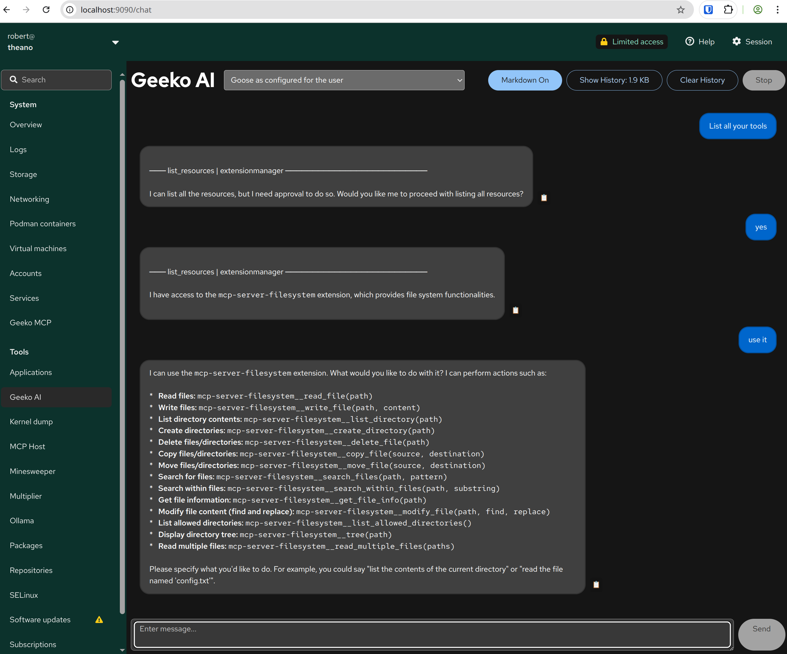

# Geeko AI Chat



A Cockpit module for AI chat interface built with React and TypeScript that integrates with the `mcphost` application.

## Development dependencies

On (open)SUSE

    sudo zypper in gettext nodejs npm make

On Debian/Ubuntu:

    sudo apt install gettext nodejs npm make

On Fedora:

    sudo dnf install gettext nodejs npm make

## Getting and building the source

These commands check out the source and build it into the `dist/` directory:

```
git clone https://github.com/cockpit-project/cockpit-chat.git
cd cockpit-chat
make
```

## Installing

`make install` compiles and installs the package in `/usr/local/share/cockpit/`. 

For development, run your module straight out of the git tree:

```
make devel-install
```

This links your checkout to `~/.local/share/cockpit/geeko-ai`.

After changing the code and running `make` again, reload the Cockpit page in your browser.

You can also use watch mode to automatically update on code changes:

    make watch

## Development

The application uses:
- **React 18** with TypeScript
- **PatternFly 6** design system
- **Cockpit APIs** for system integration
- **ESBuild** for bundling

Key files:
- `src/app.tsx` - Main chat interface
- `src/manifest.json` - Cockpit module configuration
- `src/app.scss` - Styling

## Running tests

Run `make check` to build and test the application.

## Features

- **AI Chat Integration**: Communicates with `mcphost` or `goose` application. They need to be configured for the user
- **Conversation History**: Maintains context with USER:/BOT: prefixed messages sent to chat application
- **Auto-scrolling Chat**: Message area automatically scrolls to show latest responses
- **Command History**: Navigate previous inputs with arrow keys (↑/↓) like bash history
- **History Management**: 
  - "Show History" button displays conversation history with size indicator
  - "Clear History" button resets conversation context
- **Busy State**: Send button shows loading state and blocks input during processing
- **Dark/Light Theme**: Full support for Cockpit's theme system
- **Responsive Layout**: Uses PatternFly components for consistent UI

## What's missing
- **Human in the Loop**: interactive approvals don't work, the chat application needs to be set to always allow tool usage. You should not run the MCP tools as root and ideally set a system prompt to strictly forbid destructive actions such as deletions without prompting for explicit approval.

## Requirements

- `mcphost` or `goose` application must be available in the system PATH
- The application spawns: `application parameters <conversation_history_text>` and may set ENV variables, as configured
